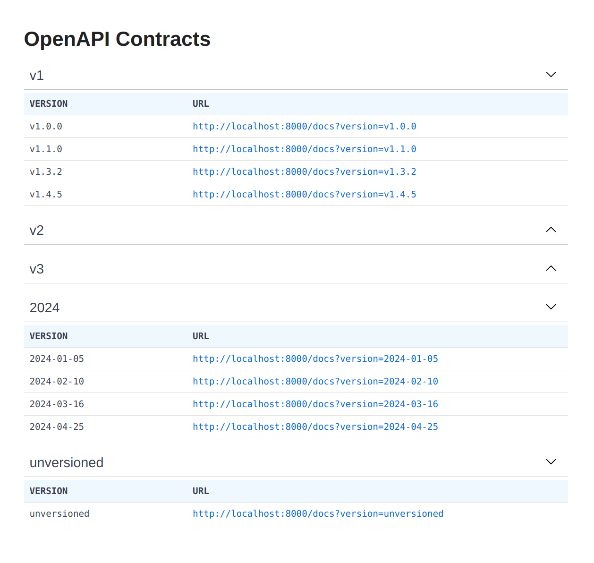

# FastAPI Version Handler

FastAPI Version Handler is a Python package that provides efficient header-based routing for API versioning in FastAPI.

## Features

- Seamless integration with FastAPI applications.
- Easily manage API versioning through HTTP headers.
- Simplified routing based on API version headers.

## Installation

To use FastAPI Version Handler, you can checkout the repository from here and add it to the PYTHONPATH:

```bash
# Set environment variables
export PYTHONPATH=$PYTHONPATH:$(pwd)/fastapi_version_handler
```

## Usage

### Example

```python
import uvicorn
from contextvars import ContextVar
from fastapi import APIRouter
from fastapi_version_handler import HeaderBasedVersionHandler

# Context variables are optional, but they can be useful for debugging.
requested_version: ContextVar[str] = ContextVar("requested_version", default=None)
returned_version: ContextVar[str] = ContextVar("returned_version", default=None)

app = HeaderBasedVersionHandler(
    requested_version=requested_version,
    returned_version=returned_version
)

router = APIRouter()
unversioned = APIRouter()

versions = [
    "v1.0.0",
    "v1.1.0",
    "v1.3.2",
    "v1.4.5",
    "v2.0.4",
    "2.2.5",  # Without 'v' prefix
    "2.3.0",
    "3.0.0",
    "2024-01-05",  # Date format
    "2024-02-10",
    "2024-03-16",
    "2024-04-25",
]

@router.get("/heros")
async def get_heroes():
    return {
        "Requested version": requested_version.get(),
        "Returned version": returned_version.get(),
        "Versions": versions
    }

@unversioned.get("/health")
async def health():
    return {"status": "ok"}

# Add versioned routes
for version in versions:
    app.include_router(
        router,
        version=version,
    )

# Add unversioned routes
app.include_router(unversioned)

if __name__ == "__main__":
    uvicorn.run(app)
```

### Additional Customizations

```python
# HeaderBasedVersionHandler inherits from FastAPI, so you can pass any FastAPI kwargs.
# Here we customize the title and enable debugging.
app = HeaderBasedVersionHandler(
    title="FastAPI Version Handler",  # Custom title. Use any FastAPI kwargs.
    debug=True,
    version_header_name="CUSTOM-X-API-Version",  # Custom header name.
    show_dashboard=False,  # True by default, disables OpenAPI Contracts landing page.
    group_versions = True,  # False by default, groups versions by major version or year.
)

# You can use include_router with HeaderBasedVersionHandler to add routers with additional options.
# Here we add a router with a specific header version and a custom URL prefix.
app.include_router(
    router,
    version="2024-04-27",
    prefix="/v2",  # Supports any include_router kwargs
)
```

### Note
In a real-world scenario, it's common to have different routers loaded for each API version to achieve proper version routing. This example demonstrates a simplified approach where a single router is loaded for every version. Depending on your application's requirements, you may need to customize the routing logic accordingly.

## Contributing

Contributions are welcome! For major changes, please open an issue first to discuss what you would like to change.

## Changelog

For a full list of changes and releases, see the [Changelog](CHANGELOG.md).

## License

This project is licensed under the MIT License - see the [LICENSE](LICENSE) file for details.

## Example Screenshot

Here's a screenshot of our application in action:


